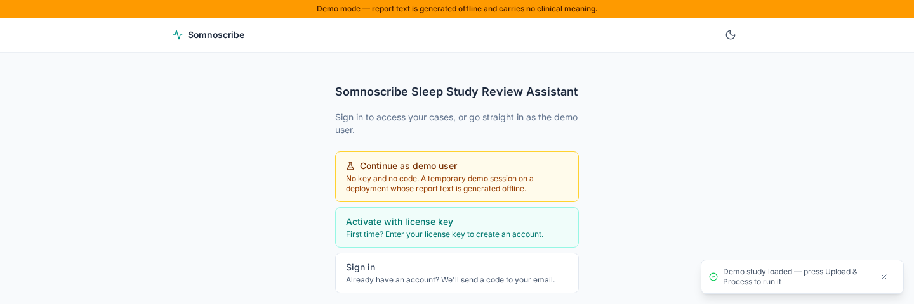
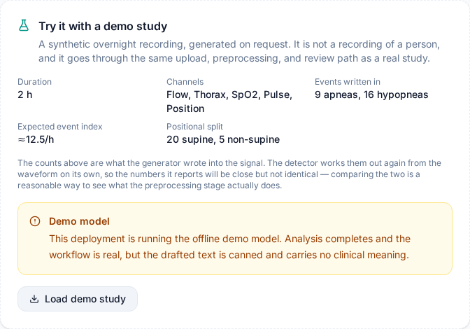

# Somnoscribe Sleep Study Review Assistant

[](https://github.com/alex-macra/somnoscribe/actions/workflows/ci.yml)
[](LICENSE)
[](CHANGELOG.md)

Somnoscribe is an experimental, self-hosted review workspace for sleep-study artifacts. It preprocesses supported files, drafts evidence-linked observations with an LLM, and requires a human reviewer to adjudicate the output before sign-off.

> Somnoscribe is clinician-assist research software. It is not an autonomous diagnostic system, medical advice, a medical device, or a claim of regulatory or production readiness. Do not use it as the sole basis for diagnosis or treatment.

This alpha release is independently buildable from this repository. It includes no patient data, clinical reference pack, licensed institutional material, or external validation dataset.

## Capabilities

- Accepts EDF, PDF, and image artifacts after signature validation, and strips identifying EDF header fields before signal processing.
- Produces signal-quality metrics, candidate windows, and a compact evidence package.
- Streams a multi-stage evidence extraction and report-drafting workflow over SSE, preserving claim-to-evidence links and a reviewer audit trail.
- Requires authentication for reference reads and administrator authorization for reference mutations.
- Starts normally without a reference pack, and says so rather than hiding that deterministic reference validation is off.
- Ships synthetic unit, integration, and three-service browser tests that make no live model call.

## Screenshots

Captured from the synthetic browser journey, so every value shown is generated
fixture data rather than a study.

| Upload                                                                             | Case list                                                                   |
| ---------------------------------------------------------------------------------- | --------------------------------------------------------------------------- |
|  |  |

Review workspace, with the three analysis passes, the reference-pack warning, and an evidence-linked finding awaiting adjudication:


Drafted report sections, each requiring a reviewer decision before sign-off:


Regenerate them with `npm run screenshots`.

## Services

| Service       | Stack                       | Default address         |
| ------------- | --------------------------- | ----------------------- |
| Web interface | React, TypeScript, Vite     | `http://localhost:5173` |
| API           | Express, TypeScript, SQLite | `http://127.0.0.1:3001` |
| Preprocessor  | FastAPI, MNE, pyEDFlib      | `http://127.0.0.1:8001` |

The web interface is `localhost` rather than a literal address because the two ways
of running it listen differently: the Vite dev server takes the IPv6 loopback and
the Docker stack publishes the IPv4 one. `localhost` reaches both. The API and
preprocessor bind `127.0.0.1` directly and are only reachable that way.

See [ARCHITECTURE.md](ARCHITECTURE.md) for boundaries and data flow, and [SAFETY.md](SAFETY.md) before evaluating the application.

## Try it without a study or an API key

Evaluating this normally needs three things most people do not have to hand: an account, a sleep study, and a model provider. None is required.

Set `SOMNOSCRIBE_DEMO_MODE=true` in the API environment and restart. In the Docker
quick start below, add it to `api/.env`. That one switch turns on all three of the
following.

**A demo user.** The sign-in screen grows a **Continue as demo user** button that takes you straight in — no invitation key to mint, no emailed code to wait for, no SMTP to configure.



The UI displays `demo@example.test` for a temporary, isolated internal demo principal. It has no administrator rights and expires with automatic cleanup. Sign-in is deliberately tied to the same switch that routes analysis to the offline model, so opening this door can never spend a real provider credential on an anonymous visitor.

**A demo study.** The upload page offers to generate one. It is a two-hour synthetic recording — flow, effort, SpO2, pulse, and body position — built from a fixed seed with roughly 25 respiratory events written into the waveform, most of them in the supine segment. It is not a recording of a person, and it takes no shortcut: it goes through the same upload, validation, de-identification, and preprocessing path as a real file.



The panel states what the generator put in. The detector recovers those events from the waveform by its own route, so the two sets of numbers will be close rather than equal — and where they differ is worth reading, because that is the preprocessing stage showing its working. Events without a coupled desaturation, for instance, are deliberately dropped from the headline count.

**A demo model.** Every analysis pass returns fixed, plainly non-clinical text instead of calling a provider. The workflow is otherwise real — the same SSE stream, persistence, citation validation, adjudication, and sign-off. The interface shows a banner for as long as it is on, because the one thing that must never be ambiguous is where a report's words came from.

Do not leave demo mode on anywhere it could be mistaken for a working deployment.

**Without any of it.** The API still starts. Sign-in, upload, preprocessing, signal quality, event detection, and the evidence package all work with no `OPENAI_API_KEY` at all. Analysis is the only thing that stops, and it says which variable to set rather than failing obscurely.

## Run with Docker

The fastest way to evaluate the application. Needs only Docker, not a local Node,
Python, or C/C++ toolchain.

```bash
cp api/.env.example api/.env
# In api/.env, set JWT_SECRET to the output of: openssl rand -base64 32
# Add SOMNOSCRIBE_DEMO_MODE=true there to evaluate without a model key or study.
docker compose up --build --wait

# Only if you did not set demo mode above: mint an invitation to sign in with.
docker compose run --rm tools scripts/generateLicenses.ts 1 starter
```

Open `http://localhost:5173`. Only the web interface is published; it proxies `/api` to the internal API container, so the browser sees a single origin. The API and preprocessor have no host ports in this stack, which keeps browser traffic behind the API's authorization and upload checks. The API refuses to start, and names the variable, if `JWT_SECRET` is absent or too short.

Case data, the SQLite database, and generated evidence live in the `evidence` volume; `docker compose down -v` deletes them.

This stack is an evaluation aid, not a hardened deployment: plain HTTP on loopback, no TLS, secret manager, backup, or retention policy. Read [SECURITY.md](SECURITY.md) before exposing it anywhere.

## Quick start

To run the services directly on the host instead. Needs Node.js 22, Python 3.12,
and a C/C++ toolchain supported by `better-sqlite3`.

```bash
./scripts/setup.sh                                    # installs deps, writes api/.env
npm --prefix api run license:generate -- 1 starter    # mint an invitation
./scripts/dev.sh                                      # all three services on loopback
```

Use the generated invitation with `/api/auth/activate` or the activation form. A model API key is needed only for analysis against a real model; everything else runs without one, and `SOMNOSCRIBE_DEMO_MODE=true` covers analysis too.

The `license` naming here is historical and unrelated to the software's own licence. These keys are seats you mint against your own database: nothing contacts a licensing service, there is no paid tier, and the `tier` column is inert because no feature reads it. The `licenseKey` field and `licenses` table keep their names for deployment compatibility.

## Configuration

Important API environment variables:

| Variable                                 | Default                 | Meaning                                                                                         |
| ---------------------------------------- | ----------------------- | ----------------------------------------------------------------------------------------------- |
| `HOST`                                   | `127.0.0.1`             | API bind address. Set a wider address explicitly for containers.                                |
| `TRUST_PROXY`                            | `false`                 | `false`, `loopback`, or a positive proxy hop count.                                             |
| `CORS_ORIGINS`                           | empty                   | Comma-separated allowed browser origins. Authenticated mutations enforce this policy.           |
| `JWT_SECRET`                             | development fallback    | Required in production and must be at least 32 bytes.                                           |
| `DB_PATH`                                | `api/data/cases.sqlite` | SQLite database path.                                                                           |
| `PREPROCESSOR_URL`                       | `http://localhost:8001` | Preprocessor base URL.                                                                          |
| `OPENAI_API_KEY`                         | unset                   | Needed for analysis against a real model. An empty value counts as unset.                       |
| `SOMNOSCRIBE_DEMO_MODE`                  | `false`                 | Answer every analysis pass from the offline demo model. Takes precedence over `OPENAI_API_KEY`. |
| `SOMNOSCRIBE_DEMO_MAX_ACTIVE_PRINCIPALS` | `24`                    | Caps simultaneous anonymous demo sessions across source IPs.                                    |
| `REFERENCE_DIR`                          | unset                   | Optional external directory of validated Markdown rules.                                        |

For reverse-proxy deployments, explicitly configure `HOST`, `TRUST_PROXY`, TLS, and `CORS_ORIGINS`. Production cookies are HTTP-only, SameSite=Lax, and Secure.

### Optional reference packs

Reference packs must stay outside the repository. When `REFERENCE_DIR` is unset, the app reports `{ enabled: false, filesLoaded: 0, rulesLoaded: 0 }` from authenticated `GET /api/references/status` and displays a warning during analysis.

The accepted file format and validation rules are documented in [docs/reference-pack-schema.md](docs/reference-pack-schema.md). A non-clinical example is available in [examples/reference-pack/synthetic-rules.md](examples/reference-pack/synthetic-rules.md).

## Checks

The full check list is in [CONTRIBUTING.md](CONTRIBUTING.md#checks). The one worth knowing about is `npm run check:boundary`, which rejects sensitive artifact types, symlinks, machine-specific paths, private source markers, non-example email addresses, and secret-like values before they can be published.

## Data handling

Never use real patient artifacts here; CI rejects them. See [SAFETY.md](SAFETY.md#data-governance) for the data policy and [SECURITY.md](SECURITY.md#deployment-responsibility) for what a self-hoster owns.

## Compatibility and trademarks

Somnoscribe contains parsers intended to interoperate with exports from SOMNOtouch™ RESP devices and DOMINO™ software. Those names are used only to describe compatibility. SOMNOtouch is a registered trademark of SOMNOmedics GmbH, and DOMINO is identified as a vendor mark. This project is independent and is not affiliated with, endorsed by, sponsored by, or supported by SOMNOmedics.

## Contributing and security

Read [CONTRIBUTING.md](CONTRIBUTING.md), [CODE_OF_CONDUCT.md](CODE_OF_CONDUCT.md), and [SECURITY.md](SECURITY.md). Please use a private GitHub security advisory for vulnerability reports; never include clinical data in a report.

## License

Copyright 2026 Alex Macra. Licensed under the [GNU Affero General Public License v3.0](LICENSE).

Evaluating, self-hosting, modifying, and running Somnoscribe inside your own organisation are all covered at no cost. The condition is reciprocity: if you modify it and let anyone reach it over a network, AGPL section 13 requires you to offer those users your modified source.

If that does not suit you — hosting it as a service, embedding it in a proprietary product, or combining it with code you cannot release under the AGPL — commercial terms are available. See [LICENSE-COMMERCIAL.md](LICENSE-COMMERCIAL.md).

Third-party components retain their own licenses; see [THIRD_PARTY_NOTICES.md](THIRD_PARTY_NOTICES.md). [NOTICE](NOTICE) records the SOMNOmedics trademark position stated above.

To cite this software, use [CITATION.cff](CITATION.cff) or the "Cite this repository" control on the GitHub project page.
