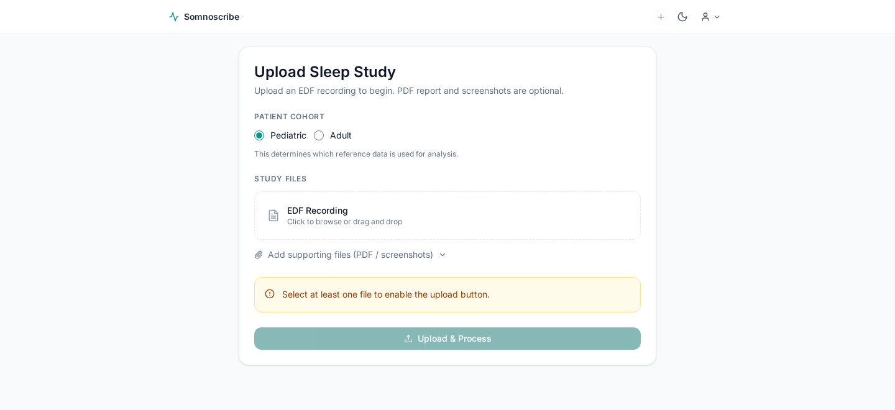
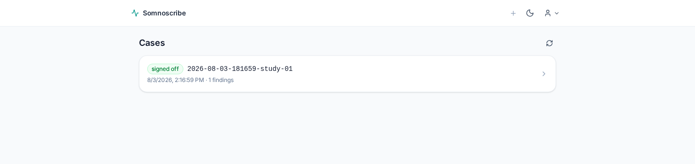
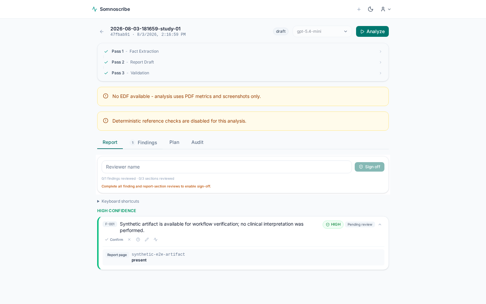
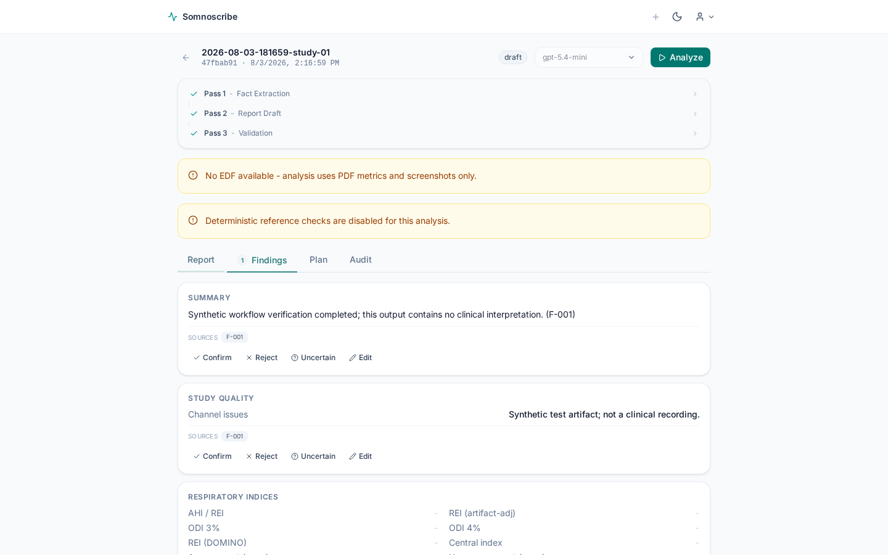

# Somnoscribe Sleep Study Review Assistant

[](https://github.com/alex-macra/somnoscribe/actions/workflows/ci.yml)
[](LICENSE)
[](CHANGELOG.md)

Somnoscribe is an experimental, self-hosted review workspace for sleep-study artifacts. It preprocesses supported files, drafts evidence-linked observations with an LLM, and requires a human reviewer to adjudicate the output before sign-off.

> Somnoscribe is clinician-assist research software. It is not an autonomous diagnostic system, medical advice, a medical device, or a claim of regulatory or production readiness. Do not use it as the sole basis for diagnosis or treatment.

This alpha release is independently buildable from this repository. It includes no patient data, clinical reference pack, licensed institutional material, or external validation dataset.

## Capabilities

- Accepts EDF, PDF, and image artifacts after signature validation.
- Removes identifying EDF header fields before signal processing.
- Produces signal-quality metrics, candidate windows, and a compact evidence package.
- Streams a multi-stage evidence extraction and report-drafting workflow over SSE.
- Preserves claim-to-evidence links and a reviewer audit trail.
- Requires authentication for reference reads and administrator authorization for reference mutations.
- Starts normally without a reference pack and visibly reports that deterministic reference validation is disabled.
- Provides synthetic unit, integration, and three-service browser tests that make no live model call.

## Screenshots

Captured from the synthetic browser journey, so every value shown is generated
fixture data rather than a study.

| Upload                                                                             | Case list                                                                   |
| ---------------------------------------------------------------------------------- | --------------------------------------------------------------------------- |
|  |  |

Review workspace, with the three analysis passes, the reference-pack warning, and an evidence-linked finding awaiting adjudication:



Drafted report sections, each requiring a reviewer decision before sign-off:



Regenerate them with `npm run screenshots`.

## Services

| Service       | Stack                       | Default address         |
| ------------- | --------------------------- | ----------------------- |
| Web interface | React, TypeScript, Vite     | `http://127.0.0.1:5173` |
| API           | Express, TypeScript, SQLite | `http://127.0.0.1:3001` |
| Preprocessor  | FastAPI, MNE, pyEDFlib      | `http://127.0.0.1:8001` |

See [ARCHITECTURE.md](ARCHITECTURE.md) for boundaries and data flow, and [SAFETY.md](SAFETY.md) before evaluating the application.

## Run with Docker

The fastest way to evaluate the application. This needs only Docker, not a local
Node, Python, or C/C++ toolchain.

```bash
cp api/.env.example api/.env    # then set JWT_SECRET to a real 32-byte value
docker compose up --build
```

The web interface is published on `http://127.0.0.1:5173` and proxies `/api` to
the API container, so the browser sees a single origin. The API refuses to start
and names the missing variable if `JWT_SECRET` is absent or too short.

Generate a local invitation once the stack is healthy:

```bash
docker compose run --rm tools scripts/generateLicenses.ts 1 starter
```

Case data, the SQLite database, and generated evidence live in the `evidence`
volume. `docker compose down -v` deletes them.

This stack is an evaluation aid, not a hardened deployment: it terminates plain
HTTP on loopback and has no TLS, secret manager, backup, or retention policy.
Read [SECURITY.md](SECURITY.md) before exposing it anywhere.

## Quick start

To run the services directly on the host instead.

Prerequisites:

- Node.js 22
- Python 3.12
- A C/C++ build toolchain supported by `better-sqlite3`

Install dependencies and create a local API configuration:

```bash
./scripts/setup.sh
```

Edit `api/.env`. A model API key is needed only when running real analysis. The services can boot and expose health checks without one.

Generate a local invitation:

```bash
npm --prefix api run license:generate -- 1 starter
```

Start all three services on loopback:

```bash
./scripts/dev.sh
```

Use the generated invitation with `/api/auth/activate` or the activation form.

The `license` naming here is historical and has nothing to do with the Apache-2.0 licence of the software itself. These keys are seats, not entitlements: you mint them yourself against your own database, nothing contacts a licensing service, and the `tier` column that defaults to `starter` is inert because no feature reads it. There is no paid tier and no gated functionality. The API request field is still `licenseKey`, and the `licenses` table still carries that name, for compatibility with existing deployments.

## Configuration

Important API environment variables:

| Variable           | Default                 | Meaning                                                                               |
| ------------------ | ----------------------- | ------------------------------------------------------------------------------------- |
| `HOST`             | `127.0.0.1`             | API bind address. Set a wider address explicitly for containers.                      |
| `TRUST_PROXY`      | `false`                 | `false`, `loopback`, or a positive proxy hop count.                                   |
| `CORS_ORIGINS`     | empty                   | Comma-separated allowed browser origins. Authenticated mutations enforce this policy. |
| `JWT_SECRET`       | development fallback    | Required in production and must be at least 32 bytes.                                 |
| `DB_PATH`          | `api/data/cases.sqlite` | SQLite database path.                                                                 |
| `PREPROCESSOR_URL` | `http://localhost:8001` | Preprocessor base URL.                                                                |
| `OPENAI_API_KEY`   | unset                   | Needed for real analysis calls.                                                       |
| `REFERENCE_DIR`    | unset                   | Optional external directory of validated Markdown rules.                              |

For reverse-proxy deployments, explicitly configure `HOST`, `TRUST_PROXY`, TLS, and `CORS_ORIGINS`. Production cookies are HTTP-only, SameSite=Lax, and Secure.

### Optional reference packs

Reference packs must stay outside the repository. When `REFERENCE_DIR` is unset, the app reports `{ enabled: false, filesLoaded: 0, rulesLoaded: 0 }` from authenticated `GET /api/references/status` and displays a warning during analysis.

The accepted file format and validation rules are documented in [docs/reference-pack-schema.md](docs/reference-pack-schema.md). A non-clinical example is available in [examples/reference-pack/synthetic-rules.md](examples/reference-pack/synthetic-rules.md).

## Checks

```bash
npm run check:boundary
npm run lint
preprocessor/.venv/bin/ruff check preprocessor
npm --prefix api run typecheck
npm --prefix api test
npm --prefix api run build
npm --prefix frontend run typecheck
npm --prefix frontend test
npm --prefix frontend run build
preprocessor/.venv/bin/pytest -q preprocessor/tests
npm run test:e2e
```

The boundary check rejects sensitive artifact types, symlinks, machine-specific paths, private source markers, non-example email addresses, and secret-like values.

## Data handling

Do not commit or upload real patient data to issues or pull requests. Clinical inputs, generated reports, databases, and private reference material are ignored and rejected by CI. Use deterministic synthetic fixtures only.

The current local SQLite and filesystem storage are intended for controlled evaluation. Operators are responsible for access control, encryption, retention, backups, consent, jurisdiction-specific privacy obligations, and deletion procedures.

## Compatibility and trademarks

Somnoscribe contains parsers intended to interoperate with exports from SOMNOtouch™ RESP devices and DOMINO™ software. Those names are used only to describe compatibility. SOMNOtouch is a registered trademark of SOMNOmedics GmbH, and DOMINO is identified as a vendor mark. This project is independent and is not affiliated with, endorsed by, sponsored by, or supported by SOMNOmedics.

## Contributing and security

Read [CONTRIBUTING.md](CONTRIBUTING.md), [CODE_OF_CONDUCT.md](CODE_OF_CONDUCT.md), and [SECURITY.md](SECURITY.md). Please use a private GitHub security advisory for vulnerability reports; never include clinical data in a report.

## License

Copyright 2026 Alex Macra. Licensed under the [Apache License 2.0](LICENSE). Third-party components retain their own licenses; see [THIRD_PARTY_NOTICES.md](THIRD_PARTY_NOTICES.md).

If you redistribute Somnoscribe in source or binary form, Apache-2.0 section 4(d) requires you to carry the [NOTICE](NOTICE) file with it. That file also records the SOMNOmedics trademark position stated above.

To cite this software, use [CITATION.cff](CITATION.cff) or the "Cite this repository" control on the GitHub project page.
